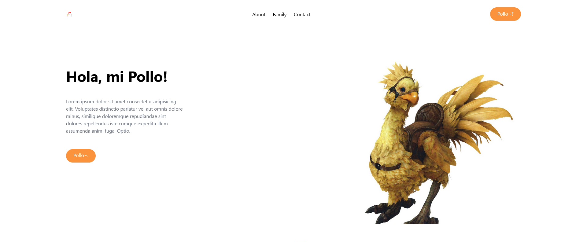
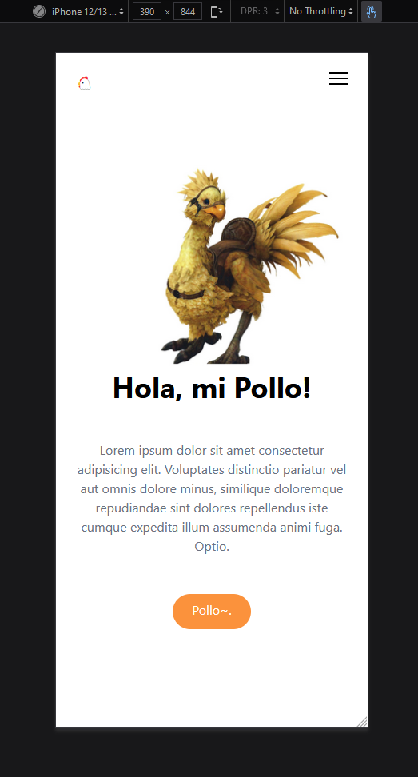

# My first responsive web template 🐔 

Here's my first webpage created with [Tailwind CSS](https://tailwindcss.com/). This page has a chicken theme because chickens are wonderful. One of the best classes of chickens are [Chocobos](https://finalfantasy.fandom.com/wiki/Chocobo) (from the JRPG game Final Fantasy) as shown below and in the [page](index.html).

  
  My page showing a chonky Chocobo. Render retrieved from <a href="https://www.creativeuncut.com/gallery-25/ff15-chocobo-render.html">Creative Uncut</a>

My goal here simply is to learn how to make a responsive webpage using a CSS framework that I can be comfortable with while disregarding content for now. 

  

I learned using [Bootstrap 5](https://getbootstrap.com/) previously because of its responsive grid system, but Tailwind seems more attractive because of its customization--and it has a proper dark mode!

The design I used is derived from a good [tutorial](https://youtu.be/dFgzHOX84xQ) by Brad of [Traversy Media](https://www.youtube.com/c/TraversyMedia) on Youtube. My plans moving forward is to learn [React JS](https://reactjs.org/) alongside Tailwind CSS to incorporate more dynamic elements in the site.

# 🥚
